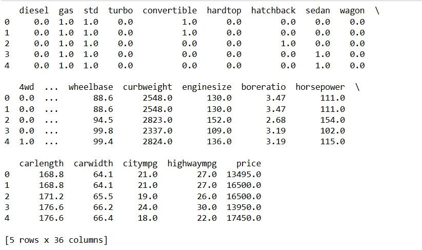
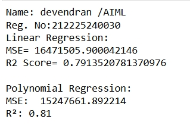
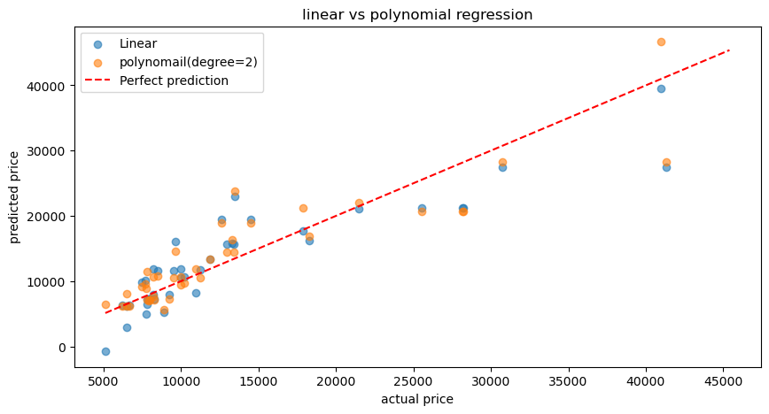

# BLENDED_LEARNING
# Implementation-of-Linear-and-Polynomial-Regression-Models-for-Predicting-Car-Prices

## AIM:
To write a program to predict car prices using Linear Regression and Polynomial Regression models.

## Equipments Required:
1. Hardware – PCs
2. Anaconda – Python 3.7 Installation / Jupyter notebook

## Algorithm
1.Data Collection: Import essential libraries like pandas, numpy, sklearn, matplotlib, and seaborn. Load the dataset using pandas.read_csv().

2.Data Preprocessing: Address any missing values in the dataset. Select key features for training the models. Split the dataset into training and testing sets with train_test_split().

3.Linear Regression: Initialize the Linear Regression model from sklearn. Train the model on the training data using .fit(). Make predictions on the test data using .predict(). Evaluate model performance with metrics such as Mean Squared Error (MSE) and the R² score.

4.Polynomial Regression: Use PolynomialFeatures from sklearn to create polynomial features. Fit a Linear Regression model to the transformed polynomial features. Make predictions and evaluate performance similar to the linear regression model. 

5.Visualization: Plot the regression lines for both Linear and Polynomial models. Visualize residuals to assess model performance.
## Program:
```
/*
Program to implement Linear and Polynomial Regression models for predicting car prices.
Developed by: DEVENDRAN G
RegisterNumber: 212225240030 

import pandas as pd
from sklearn.model_selection import train_test_split
from sklearn.linear_model import LinearRegression
from sklearn.preprocessing import PolynomialFeatures,StandardScaler
from sklearn.pipeline import Pipeline
from sklearn.metrics import mean_squared_error,r2_score,mean_absolute_error
import matplotlib.pyplot as plt

#Load data
df=pd.read_csv('encoded_car_data (1).csv')
print(df.head())

#select features & target 
x=df[['enginesize','horsepower','citympg','highwaympg']]
y=df['price']

#split data
x_train,x_test,y_train,y_test=train_test_split(x,y,test_size=0.2,random_state=42)


#linear regression (with scaling)
lr=Pipeline([
    ('scaler',StandardScaler()),
    ('model',LinearRegression())
])
lr.fit(x_train,y_train)
y_pred_linear=lr.predict(x_test)


#polynomial regression (degrees=2)
poly_model = Pipeline([
    ('poly',PolynomialFeatures(degree=2)),
    ('scaler',StandardScaler()),
    ('model',LinearRegression())
])
poly_model.fit(x_train,y_train)
y_pred_poly=poly_model.predict(x_test)

#evaluate models
print('Name: devendran /AIML')
print('Reg. No:212225240030')
print("Linear Regression:")
# ese-mean_squared error(y_test, y pred linear)
print('MSE=',mean_squared_error(y_test, y_pred_linear))
r2score=r2_score(y_test,y_pred_linear)
print('R2 Score=', r2score)

# print (fSE: (mean_squared_error(y_test, y pred_linear):.2f)") 
#print(f"R: (r2_score(y_test, y_pred_linear):.2f)")

print("\nPolynomial Regression:")
print (f"MSE: {mean_squared_error(y_test, y_pred_poly): 2f}") 
print(f"R²: {r2_score(y_test, y_pred_poly):.2f}")

#plot the actual and predicted
plt.figure(figsize=(10,5))
plt.scatter(y_test,y_pred_linear,label='Linear',alpha=0.6)
plt.scatter(y_test,y_pred_poly,label='polynomail(degree=2)',alpha=0.6)
plt.plot([y.min(),y.max()],[y.min(),y.max()],'r--',label='Perfect prediction')
plt.xlabel("actual price")
plt.ylabel("predicted price")
plt.title("linear vs polynomial regression")
plt.legend()
plt.show()

*/
```

## Output:







## Result:
Thus, the program to implement Linear and Polynomial Regression models for predicting car prices was written and verified using Python programming.
